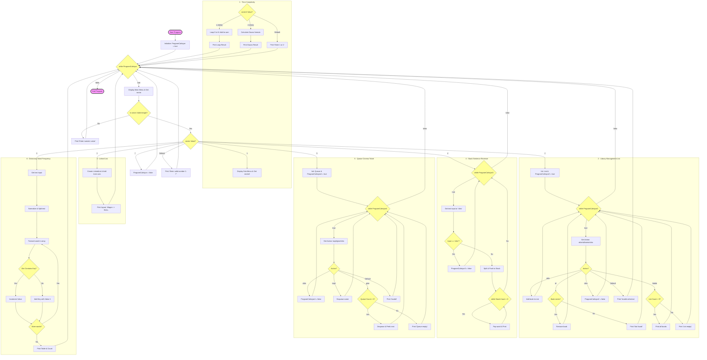

# C# Data Structures & Algorithmic Complexity Lab

This repository contains a console-based interactive application built with C# to demonstrate and simulate core data structures and algorithmic complexity concepts (Big O navigation). It serves as a practical laboratory for fundamental computer science topics.


## 🛠️ Features & Concepts Covered

The application consists of 6 interactive modules, each demonstrating a different computer science principle:

1. **Time Complexity ($O(N)$ vs $O(1)$):** Compares a traditional loop-based summation (Brute Force - $O(N)$) against Gauss's Elimination Formula ($O(1)$) to visually demonstrate performance scale.
2. **Dynamic Arrays (`List<T>`):** A basic Library Management Simulation demonstrating dynamic sizing, item addition, and sequential searching/deletion.
3. **Linked Lists (`LinkedList<T>`):** Visualizes sequential data elements where each element points to the next, emphasizing non-contiguous memory allocation.
4. **Stack (LIFO - Last In, First Out):** A Sentence Reverser algorithm that utilizes a Stack to flip the order of words in a given input.
5. **Queue (FIFO - First In, First Out):** A Cinema Ticket Queue simulation displaying fair resource management where the first user in line is the first served.
6. **Dictionary / Hash Table ($O(1)$ Lookups):** A Word Frequency Counter that analyzes an input text and tracks exact word counts with constant-time complexity lookups using hashing.


### Architecture Flowchart


---

## 🚀 How to Run

### Prerequisites
* [.NET SDK](https://dotnet.microsoft.com/download) (Version 6.0 or higher recommended)
* An IDE like Visual Studio, Visual Studio Code, or JetBrains Rider.

### Execution
1. Clone the repository:
   ```bash
   https://github.com/EgeSul/data-structures-and-bigO-simulation.git
